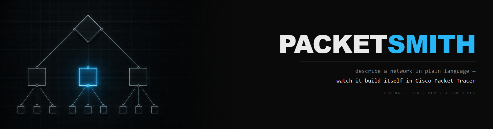
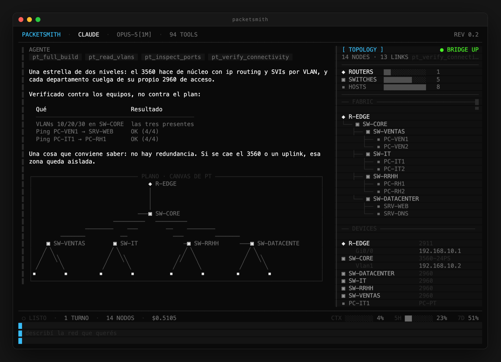
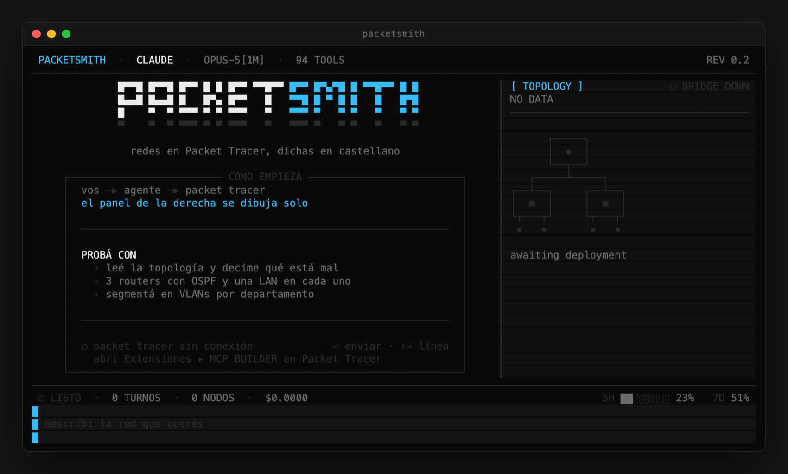
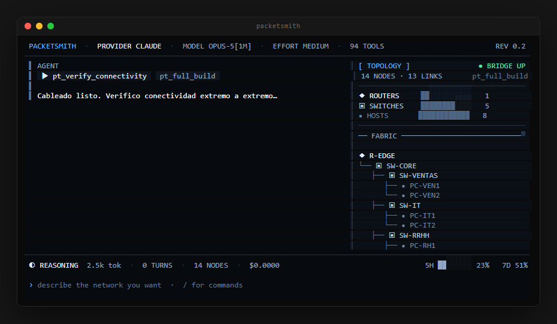

<div align="center">



**Say _"three routers with OSPF and a LAN each"_ — and watch the topology appear in Cisco Packet Tracer while the panel on your right draws itself.**

[](https://github.com/Mats2208/packetsmith/releases)
[](https://bun.sh)
[](https://www.typescriptlang.org/)
[](https://github.com/sst/opentui)
[](https://modelcontextprotocol.io)
[](test/)
[](LICENSE)

<br/>

<table>
<tr>
<td align="center"><strong>Purpose-built UI</strong><br/><sub>not a chat window</sub></td>
<td align="center"><strong>Live topology</strong><br/><sub>tree + canvas plan</sub></td>
<td align="center"><strong>Real verification</strong><br/><sub>pings, not promises</sub></td>
<td align="center"><strong>Plan + context meters</strong><br/><sub>know what you're burning</sub></td>
<td align="center"><strong>177 tests</strong><br/><sub>UI included</sub></td>
</tr>
</table>

**Powered by [MCP-Packet-Tracer](https://github.com/Mats2208/MCP-Packet-Tracer) — 61 tools driving a running copy of Packet Tracer over a local bridge.**

</div>

---

## Showcase

<p align="center">
  
</p>
<p align="center"><sub>One turn, end to end — what the agent ran, what it verified <strong>against the devices</strong>, the plan drawn from Packet Tracer's real canvas coordinates, and the panel on the right built from the same tool results.</sub></p>

<table>
<tr>
<td width="50%">
<p align="center"></p>
<p align="center"><sub>First run. Three copyable examples and a <strong>live</strong> bridge indicator — if Packet Tracer isn't connected it says where the switch is.</sub></p>
</td>
<td width="50%">
<p align="center"></p>
<p align="center"><sub>Mid-turn. The CLI reports its own phase, so <em>reasoning for thirty seconds</em> and <em>hung</em> no longer look the same.</sub></p>
</td>
</tr>
</table>

> Every screenshot above is generated from the source by `bun run shots` — real renders, not mockups. They cannot go stale.

---

## What it is

PacketSmith **does not implement an agent**. It wraps one you already have — [Claude Code](https://claude.com/claude-code) today, Codex and OpenCode next — and gives it an interface built for network labs instead of for editing files.

| | | |
|---|---|---|
| **Talk** | plain language, in any language | `crea 3 routers con OSPF y una LAN en cada uno` |
| **Fabric** | the scaffold — what hangs off what | tree with real guides, roots at the routers |
| **Devices** | per-device config | model, interfaces, addresses |
| **Plan** | the layout, from PT's own `x, y` | drawn under the reply that changed it |
| **Activity** | phase, reasoning tokens, clock | `◐ RAZONANDO · 2.5k tok · 1m12s` |
| **Budget** | context window and plan quota | `CTX ██░░░░░░ 18% · 5H ███░░░░░ 23%` |
| **Timing** | where a turn actually went | `⏱ 2m40s · 34s en packet tracer (21%) · 2m06s en el modelo` |

**Why the topology is drawn instead of screenshotted:** a rendered tree works in every terminal, shows state a bitmap cannot (IPs, links, port status), and can be navigated. The real Packet Tracer capture stays one `pt_screenshot` away.

## Two views of the same network

They answer different questions, which is why both exist.

| | Answers | Lives in |
|---|---|---|
| **Fabric tree** | *what hangs off what* | the right panel, always current |
| **Canvas plan** | *how it is laid out* | under the reply that changed it |

An uplink crossing from one edge of the canvas to the other is obvious in the plan and invisible in the tree. Which switch a host hangs off is obvious in the tree and a guess in the plan.

The plan is drawn only when the **layout changed** — moving one device counts. Repeating an identical figure under every reply turns it into wallpaper and it stops being looked at.

## Status: alpha

Working today: the streaming engine, the split-screen TUI, the fabric tree and canvas plan, the activity and budget meters, and per-turn timing. Not there yet: Codex/OpenCode adapters, multi-session, packaging.

## Requirements

PacketSmith **runs on top of the MCP — it does not bundle it.** Three pieces, in this order:

| | Why | How |
|---|---|---|
| [Bun](https://bun.sh) ≥ 1.3 | OpenTUI needs it — this will **not** run on Node | `brew install oven-sh/bun/bun` |
| `claude` CLI, authenticated | PacketSmith spawns it; it is the agent | [claude.com/claude-code](https://claude.com/claude-code) |
| [MCP-Packet-Tracer](https://github.com/Mats2208/MCP-Packet-Tracer) **registered with the CLI** | it is what actually drives Packet Tracer | `claude mcp add packet-tracer …` |

Plus Cisco Packet Tracer itself, running, with **Extensions ▸ MCP BUILDER** open.

If the MCP is not registered, PacketSmith says so on its first screen and prints the command
— because the failure is silent otherwise: the agent starts, answers normally, and has no
`pt_*` tools at all.

## Run

There is **no npm package yet** — and `npm install` would not work anyway, since this needs
Bun rather than Node. Clone it:

```bash
git clone https://github.com/Mats2208/packetsmith
cd packetsmith
bun install
bun run src/index.tsx
```

> **One MCP client at a time.** The Packet Tracer MCP binds `127.0.0.1:54321` and only one process can hold it. If Claude Code, Cursor or Claude Desktop is running with that MCP configured, **close it first** — otherwise every `pt_*` call answers *"no está conectado"*.

<kbd>⏎</kbd> sends · <kbd>⇧⏎</kbd> newline · <kbd>⌥⏎</kbd> and <kbd>^J</kbd> also work, for terminals that swallow Shift+Enter.

### The plan-usage meter

The status bar can show how much of your Claude plan you have burned (`5H ███████░ 84%`). That number is **not** in the CLI's output — it comes from Anthropic's own usage endpoint, which needs the OAuth token the `claude` CLI already stored when you logged in.

So on first run PacketSmith reads it: from `~/.claude/.credentials.json`, or from the macOS Keychain, where macOS will ask your permission. **Say no and nothing breaks** — you keep the window countdown (`5H ✓ 1h30`), which comes from the stream and costs nothing.

The token is sent to `api.anthropic.com` and nowhere else. It is never stored, printed or logged.

```bash
PACKETSMITH_NO_QUOTA=1 bun run src/index.tsx   # skip the lookup entirely
PACKETSMITH_ALL_MCP=1  bun run src/index.tsx   # load every MCP server, not just Packet Tracer
```

## This or the MCP?

Wrong question — **PacketSmith runs the MCP underneath.** You need it either way. What changes is what sits on top:

|  | The MCP alone | The MCP + PacketSmith |
|---|---|---|
| Where you talk | Claude Code, Cursor, Claude Desktop | a terminal app built for this one job |
| What you see | a chat log, and Packet Tracer in another window | split screen: reply left, live topology right |
| Topology | you read it out of the tool output | fabric tree and canvas plan, drawn for you |
| Turn cost | whatever your client shows | context, plan quota, and where the time went |
| Tools loaded | every MCP server you have configured | Packet Tracer only — measurably faster to start |
| Engine | your client decides | Claude *(Codex / OpenCode coming)* |

**If you already live in Claude Code, the MCP alone is all you need.** PacketSmith is for when you want the topology in front of you instead of buried in a scrollback.

## How it works

```
PacketSmith ──spawn──> claude --output-format stream-json
                          │  (NDJSON, event by event)
                          ├──> left panel:  text · tool badges · canvas plan
                          └──> right panel: pt_* results → fabric + devices
                                 │
                          claude ──stdio──> MCP-Packet-Tracer ──HTTP:54321──> Packet Tracer
```

**The TUI never talks to the MCP.** That bridge port only fits one process; opening our own client would spawn a second server and the two would fight over it. Everything the panel needs already arrives in the agent's stream.

Every engine translates its own output into a single `AgentEvent` union, so the UI never knows which one is running. Adding an engine is one file plus one line — see **[AGENTS.md](AGENTS.md)**.

### Measured, not assumed

| | |
|---|---|
| Event consumption | **129k events/s** — 2600× more than the CLI can emit, so we are never the bottleneck (`bun run bench`) |
| MCP scoping | 178 tools / 7 servers → **4761 ms** to first token; scoped to Packet Tracer alone → **1989 ms** |
| Where a turn goes | the `⏱` line splits it: time in Packet Tracer vs time in the model |

Every `pt_*` call is one HTTP round-trip to Packet Tracer, strictly serial — `pt_live_deploy` verifies one device and one link at a time. That is usually what "the agent is slow" actually means.

## Development

```bash
bun test          # 177 tests — engine, topology and rendered UI frames
bun run typecheck
bun run preview   # print the UI in fixed states, without an agent or Packet Tracer
bun run shots     # regenerate the README screenshots from the source
bun run bench     # prove the event loop is not the bottleneck
```

UI behaviour is tested by rendering to a character buffer and asserting what is on screen — including colours, because a gauge whose full and empty halves are the same tone measures nothing. See the OpenTUI traps table in [AGENTS.md](AGENTS.md); every one of them is invisible to `tsc`.

## Related

- **[MCP-Packet-Tracer](https://github.com/Mats2208/MCP-Packet-Tracer)** — the MCP server underneath. 61 tools, 74 device models, live deploy.
- **[HyprDesk](https://github.com/Mats2208/HyprDesk)** — same idea, different shape: orchestrate a team of coding agents on the desktop.

## License

MIT © [Mats2208](https://github.com/Mats2208)
